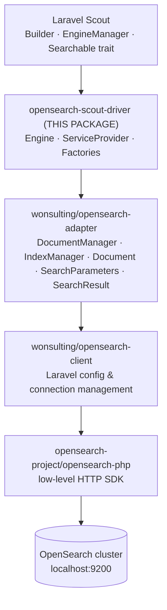
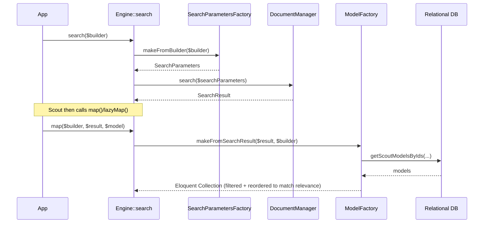
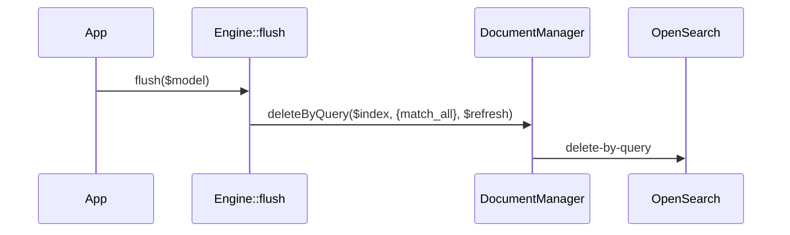

# Architecture

This document describes the internal structure of **`wonsulting/opensearch-scout-driver`** — what each
class does, how the package boots itself into Laravel, and how data flows through it. For day-to-day
commands (install, test, run OpenSearch locally, release), see the [operational runbook](runbook.md).

## Purpose

`opensearch-scout-driver` is an [OpenSearch](https://opensearch.org/) driver for
[Laravel Scout](https://laravel.com/docs/scout). It is a **thin translation layer**: it implements
Scout's `Engine` contract and delegates all real OpenSearch work to the
[`wonsulting/opensearch-adapter`](https://github.com/wonsulting/opensearch-adapter) package. The engine
itself contains no HTTP logic and speaks to OpenSearch only through the adapter's `DocumentManager` and
`IndexManager`.

The package is a WonsultingAI-maintained fork of Ivan Babenko's original
`babenkoivan/elastic-scout-driver` lineage (see `authors` in `composer.json`).

## Layer diagram

Scout calls into this engine; the engine calls the adapter; the adapter calls the client; the client
wraps the official SDK. Only the middle box is this package.



Dependency notes:

- **Laravel Scout** is provided by the host application (it is a `require-dev` here for testing, not a
  runtime `require`). This package registers itself as the `opensearch` Scout driver.
- **`wonsulting/opensearch-adapter`** (`^2.1`) is the only hard runtime dependency in `composer.json`.
- **`wonsulting/opensearch-client`** and **`opensearch-php`** arrive transitively through the adapter.
  All connection/host/auth settings live in the client package's `config/opensearch.client.php`, **not**
  in this package (see [Config schema](#config-schema)).

## Directory map

```
src/
├── Engine.php                              OpenSearch\ScoutDriver\Engine — the Scout Engine
├── ServiceProvider.php                     OpenSearch\ScoutDriver\ServiceProvider (final) — bootstrap
└── Factories/
    ├── SearchParametersFactory.php         Scout Builder      → adapter SearchParameters
    ├── SearchParametersFactoryInterface.php
    ├── DocumentFactory.php                  Eloquent models    → adapter Documents
    ├── DocumentFactoryInterface.php
    ├── ModelFactory.php                     adapter SearchResult → Eloquent models
    └── ModelFactoryInterface.php
config/
└── opensearch.scout_driver.php             single option: refresh_documents

tests/
├── App/                                    Testbench fixture app
│   ├── Client.php                          searchable Eloquent model (Searchable + SoftDeletes)
│   ├── database/factories/                 model factory (legacy-factories style)
│   ├── database/migrations/                SQL migration for the clients table
│   └── opensearch/migrations/              OpenSearch index migration (create_clients_index)
└── Integration/                            all tests (see runbook — there is no unit suite)
    ├── Engine/                             EngineIndex/Update/Delete/Search tests
    ├── Factories/                          Document/Model/SearchParameters factory tests
    └── TestCase.php                        Orchestra Testbench base class
```

Production code is eight PHP files under `src/` (PSR-4 root `OpenSearch\ScoutDriver\` → `src`).

## Class-by-class reference

### `ServiceProvider` — `src/ServiceProvider.php`

`final class ServiceProvider extends Illuminate\Support\ServiceProvider`. Registered via Laravel package
auto-discovery, declared in `composer.json`:

```json
"extra": { "laravel": { "providers": ["OpenSearch\\ScoutDriver\\ServiceProvider"] } }
```

It defines a weak-binding table mapping each factory interface to its default implementation:

```php
private array $weakBindings = [
    ModelFactoryInterface::class            => ModelFactory::class,
    DocumentFactoryInterface::class         => DocumentFactory::class,
    SearchParametersFactoryInterface::class => SearchParametersFactory::class,
];
```

- **`register()`** — merges the package config under the key `opensearch.scout_driver`, then binds each
  factory with `bindIf`. Because it is `bindIf` (not `bind`/`singleton`), a host application that has
  already bound one of these interfaces **wins** — this is the extension point for customizing how the
  engine builds search parameters, documents, or models.

  ```php
  $this->mergeConfigFrom($this->configPath, basename($this->configPath, '.php'));

  foreach ($this->weakBindings as $key => $value) {
      $this->app->bindIf($key, $value);
  }
  ```

- **`boot()`** — publishes the config file and registers the driver with Scout's `EngineManager` under
  the name `opensearch`:

  ```php
  $this->publishes([$this->configPath => config_path(basename($this->configPath))]);

  resolve(EngineManager::class)->extend('opensearch', static fn () => resolve(Engine::class));
  ```

  The `Engine` is resolved from the container on each call (not shared), so its five constructor
  dependencies are auto-wired every time — see [DI / bootstrap flow](#di--bootstrap-flow).

### `Engine` — `src/Engine.php`

`class Engine extends Laravel\Scout\Engines\Engine`. Its constructor stores five collaborators and reads
the `refresh_documents` flag once:

```php
public function __construct(
    DocumentManager $documentManager,                          // adapter
    DocumentFactoryInterface $documentFactory,                 // this package
    SearchParametersFactoryInterface $searchParametersFactory, // this package
    ModelFactoryInterface $modelFactory,                       // this package
    IndexManager $indexManager                                 // adapter
) {
    $this->refreshDocuments = (bool)config('opensearch.scout_driver.refresh_documents');
    // ...assign the rest
}
```

`DocumentManager` and `IndexManager` come from `OpenSearch\Adapter\…`; the three factory interfaces are
resolved from the `bindIf` table above.

The Scout `Engine` methods it implements:

| Method | What it does | Delegates to |
|---|---|---|
| `update($models)` | Early-returns if empty. Index = `$models->first()->searchableAs()`. Builds `Document[]`, then indexes them. | `DocumentFactory::makeFromModels` → `DocumentManager::index($index, $documents, $refresh)` |
| `delete($models)` | Early-returns if empty. Collects string scout keys. | `DocumentManager::delete($index, $documentIds, $refresh)` |
| `search(Builder $builder)` | Builds `SearchParameters` from the builder, runs the search. Returns the adapter `SearchResult` (this is what Scout's `raw()` exposes). | `SearchParametersFactory::makeFromBuilder` → `DocumentManager::search` |
| `paginate(Builder, $perPage, $page)` | Same as `search`, but passes `perPage`/`page` so the factory computes `from`/`size`. | `SearchParametersFactory::makeFromBuilder` → `DocumentManager::search` |
| `mapIds($results)` | Plucks document ids from the hits (used by `keys()`). Returns a base `Collection`. | `SearchResult::hits()` |
| `map(Builder, $results, $model)` | Hydrates an ordered Eloquent `Collection`. | `ModelFactory::makeFromSearchResult` |
| `lazyMap(Builder, $results, $model)` | Hydrates an ordered `LazyCollection`. | `ModelFactory::makeLazyFromSearchResult` |
| `getTotalCount($results)` | Total hit count. | `SearchResult::total()` |
| `flush($model)` | Deletes **all documents** in the model's index via a `match_all` query (contrast with `deleteIndex`). | `DocumentManager::deleteByQuery($index, $query, $refresh)` |
| `createIndex($name, $options=[])` | Creates the index. Throws `InvalidArgumentException` if a custom `primaryKey` is requested (OpenSearch's `_id` cannot be renamed). | `IndexManager::create(new Index($name))` |
| `deleteIndex($name)` | Drops the entire index. | `IndexManager::drop($name)` |

Behavioral notes worth knowing:

- The `search` **callback parameter is intentionally ignored** — the driver does not expose the internal
  engine to a user closure (documented under "Pitfalls" in the README).
- `flush` empties an index's documents; `deleteIndex` removes the index itself. They are different
  operations backed by different adapter managers.

### The three factories — `src/Factories/`

Each factory is an interface plus one default implementation. The interfaces are the seam the host app
overrides via `bindIf`.

**`SearchParametersFactory` — Scout `Builder` → adapter `SearchParameters`**

```php
public function makeFromBuilder(Builder $builder, array $options = []): SearchParameters;
```

`makeFromBuilder` assembles a `SearchParameters` object from small, individually overridable `protected`
helpers (subclass one to customize just that facet):

| Helper | Produces |
|---|---|
| `makeIndex` | `$builder->index ?: $builder->model->searchableAs()` — honors Scout's `within()`. |
| `makeQuery` | A `bool` query. With a query string → `bool.must = query_string`; empty → `bool.must = match_all`. Adds `bool.filter` when filters exist. |
| `makeFilter` | Maps `$builder->wheres` to `term` clauses and (when the Scout version supports it) `$builder->whereIns` to `terms` clauses. |
| `makeSort` | Maps `$builder->orders` to `[{column: direction}]`. |
| `makeFrom` | Pagination offset `($page - 1) * $perPage` when both options are present. |
| `makeSize` | `$options['perPage'] ?? $builder->limit` (page size, or a `take()` limit). |

**`DocumentFactory` — Eloquent models → adapter `Document[]`**

```php
public function makeFromModels(Collection $models): Collection; // of OpenSearch\Adapter\Documents\Document
```

Per model: if `scout.soft_delete` is enabled and the model uses `SoftDeletes`, it calls
`pushSoftDeleteMetadata()`. The document id is `(string)$model->getScoutKey()`; the content is
`array_merge($model->scoutMetadata(), $model->toSearchableArray())`. It **rejects a reserved `_id`
field** in the content, throwing `UnexpectedValueException` (OpenSearch's `_id` cannot be part of the
document body).

**`ModelFactory` — adapter `SearchResult` → Eloquent models**

```php
public function makeFromSearchResult(SearchResult $searchResult, Builder $builder): Collection;
public function makeLazyFromSearchResult(SearchResult $searchResult, Builder $builder): LazyCollection;
```

Both short-circuit to an empty collection when the result total is zero. Otherwise they pluck the
ordered document ids from the hits, hydrate models from the relational database
(`getScoutModelsByIds` for the eager path, `queryScoutModelsByIds(...)->cursor()` for the lazy path),
then run two private steps:

- `filterModels` — drops any hydrated row whose scout key is not in the result ids.
- `sortModels` — reorders the rows to match OpenSearch's relevance order, using
  `array_flip($documentIds)` to look up each id's position. This is necessary because the SQL
  `whereIn` used to hydrate does not preserve the search-result order.

## DI / bootstrap flow

```
1. composer install / package discovery
   └─ composer.json  extra.laravel.providers  →  ServiceProvider is auto-registered
2. ServiceProvider::register()
   ├─ mergeConfigFrom(config/opensearch.scout_driver.php, "opensearch.scout_driver")
   └─ bindIf each factory interface → default implementation (host app can override)
3. ServiceProvider::boot()
   ├─ publishes() the config file (for `vendor:publish`)
   └─ EngineManager::extend('opensearch', fn () => resolve(Engine::class))
4. First time Scout needs the "opensearch" driver
   └─ resolve(Engine::class)  →  container auto-wires:
        DocumentManager, IndexManager      (from the adapter/client providers)
        DocumentFactory / SearchParameters / ModelFactory  (from the bindIf table)
```

Because the `EngineManager::extend` closure calls `resolve(Engine::class)` each time, overriding a
factory binding in the host app takes effect on the next engine resolution — no service-provider changes
required.

## Data flow

### Indexing a model

Triggered when a `Searchable` model is saved (Scout's observer) or via `Model::searchable()`.

```mermaid
sequenceDiagram
    participant M as Eloquent model
    participant S as Scout
    participant E as Engine::update
    participant DF as DocumentFactory
    participant DM as DocumentManager (adapter)
    participant OS as OpenSearch

    S->>E: update($models)
    E->>DF: makeFromModels($models)
    DF-->>E: Collection&lt;Document&gt;
    E->>DM: index($index, $documents, $refresh)
    DM->>OS: bulk index request
```

### Searching

Triggered by `Model::search('...')->get()` (or `->paginate()`, `->keys()`, `->cursor()`).



`keys()` routes through `mapIds` instead of `map`; `paginate()` routes through `paginate` (which adds
`from`/`size`) and `getTotalCount`; `raw()` returns the `SearchResult` from `search` directly.

### Flushing an index

Triggered by `Model::removeAllFromSearch()`.



This empties the index of documents but leaves the index itself in place. To remove the whole index, use
`deleteIndex` → `IndexManager::drop`.

## `refresh_documents` semantics

`refresh_documents` (config key `opensearch.scout_driver.refresh_documents`, default `false`) is read
once in the `Engine` constructor and passed as the trailing `refresh` argument to the three write
operations: `DocumentManager::index`, `::delete`, and `::deleteByQuery`.

It maps directly to OpenSearch's write-time
[`refresh` parameter](https://opensearch.org/docs/latest/api-reference/document-apis/index-document/):

- `false` (default) — writes become searchable after OpenSearch's normal near-real-time refresh
  interval (~1 second). Best for production throughput.
- `true` — the affected index is refreshed immediately, so a write is visible to the **very next**
  search. This is primarily useful for **testing**: the integration test base class sets it to `true`
  so a test can index a document and assert on searching it in the same request.

It affects write-visibility latency only — not search behavior or correctness.

## Config schema

The package ships a single config file, `config/opensearch.scout_driver.php`:

```php
return [
    'refresh_documents' => env('OPENSEARCH_SCOUT_DRIVER_REFRESH_DOCUMENTS', false),
];
```

| Key | Type | Default | Env override | Meaning |
|---|---|---|---|---|
| `refresh_documents` | bool | `false` | `OPENSEARCH_SCOUT_DRIVER_REFRESH_DOCUMENTS` | See [refresh_documents semantics](#refresh_documents-semantics). |

**All OpenSearch connection settings** (hosts, ports, auth, SSL) live in a **separate package**,
`wonsulting/opensearch-client`, in its own `config/opensearch.client.php` (published from
`OpenSearch\Laravel\Client\ServiceProvider`). This driver holds no connection configuration of its own.
```
